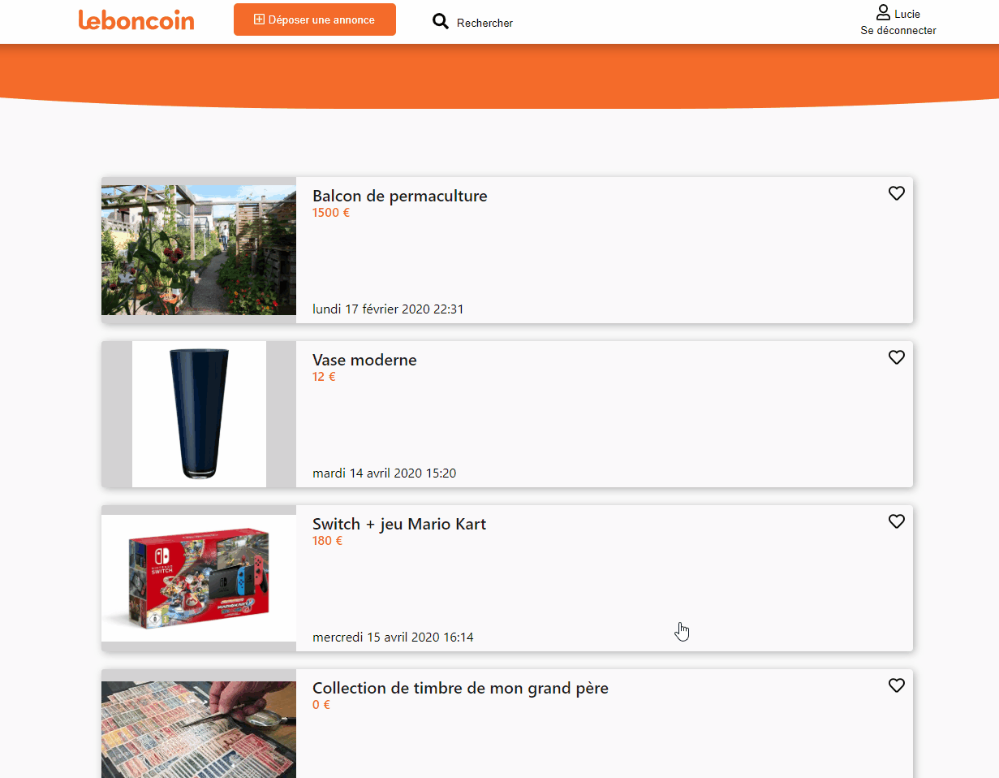

<h1>Leboncoin clone</h1>

## Functionalities

- Authentication :
  - signup
  - signin
  - cookies
- Publish offer
- Get detail of an offer
- Buy whith Stripe :
  - credit card number : 4242 4242 4242 4242
  - expiration date must be in the futur

## Dependencies

- React
- axios
- react-router-dom
- react-stripe-element
- js-cookies
- react-spinners (loaders)
- rc-pagination
- moment (dates)

## Deployment

- Client deployed with Netlify
- Server deployed with Heroku
- MongoDb database hosted on Mlab

This project was bootstrapped with [Create React App](https://github.com/facebook/create-react-app).
